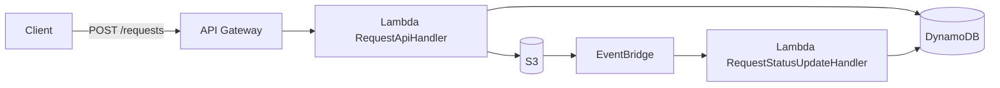

# SPEC

## 結論

本ハンズオンは、**実務での拡張性と運用性を意識しつつ、最小構成で実際に動くものを作る**方針とします。  
対象は、**業務システム寄りのファイル受付・状態管理API**であり、構成は **JavaベースのLambda API + S3ファイル保管 + DynamoDB状態管理**です。

## 背景

- `PLAN.md` では、Javaで REST API + Presigned URL発行 + DynamoDB状態管理を一気通貫で扱う単一のAWS公式ハンズオンは未発見と整理した
- そのため、公式サンプルを組み合わせて、実務に近い最小構成を作る方針が妥当と判断した
- ユーザーとの相談の結果、まずは「全部盛り」ではなく、**最小構成で動作するもの**を優先する

## 目的

- AWSサービス選定理由と構成意図を、実装可能な範囲で明確に説明できる形にする
- 実務での保守・拡張を見据えた最小構成を先に成立させる
- 今後の拡張に耐える最小実装を先に完成させる

## 方向性

- JavaでLambdaを実装する
- API GatewayでAPIを公開する
- S3でファイル本体を保管する
- DynamoDBで受付情報と処理状態を管理する

## 対象読者・利用シーン

- 実務を想定し、サーバーレス設計・実装の判断過程を整理したいケース
- 手順だけでなく、構成選択の理由まで説明可能にしたいケース
- GitHub等で、構成意図のあるハンズオン成果物として提示したいケース

## 採用方針

### 採用するスコープ

- Java製LambdaによるREST API
- API Gatewayによるエンドポイント公開
- S3によるファイル本体保管
- DynamoDBによる受付状態管理
- 画面を持たないAPI中心の構成
- 初期版は利用者を限定した閉域的な利用形態を前提とする

### 今回は見送るスコープ

- 一般公開向けの認証・認可設計
- 非同期バッチ本体
- 通知機能
- フロント画面
- 複雑な検索条件
- 大規模向けの高度な運用監視

## ハンズオンの対象機能

### API

- `POST /requests`
  - 受付を登録する
  - `requestId` を払い出す
  - S3アップロード用Presigned URLを返す
- `GET /requests/{id}`
  - 指定した受付IDの状態を返す
- `GET /requests`
  - 受付一覧を返す

### 状態管理

初期版では、以下を扱う。

- 実運用で利用する最小状態
  - `RECEIVED`（受付作成直後）
  - `COMPLETED`（S3アップロード完了イベント反映後）
- 将来拡張向けにEnumで保持する状態
  - `PROCESSING`
  - `FAILED`（本ハンズオン時点では遷移実装を保留）

### データ項目

初期版の受付データは、以下を最小セットとする。

- `requestId`
- `userId`
- `fileName`
- `s3Key`
- `status`
- `createdAt`
- `updatedAt`

## 要件定義

### 要件の結論

初期版で実現するのは、**利用者がAPIで受付を登録し、発行されたPresigned URLでS3へファイルを直接アップロードし、その受付状態をAPIで参照できること**です。

### 想定ユースケース

- 利用者がアップロード対象ファイルの受付を登録する
- 利用者が発行されたPresigned URLを使ってS3へファイルをアップロードする
- 利用者が受付単位で処理状態を確認する
- 利用者が受付一覧を確認する

### 業務要件

- ファイル受付を一意な `requestId` で管理できること
- 受付情報と処理状態をDynamoDBで管理できること
- ファイル本体をS3に保存できること
- APIは画面なしでも利用できること
- 将来、承認機能や利用者拡張を追加しやすい構成であること

### 機能要件

- `POST /requests` で受付登録ができること
- `POST /requests` の結果として `requestId` とPresigned URLを返せること
- 返却されたPresigned URLでS3へファイルアップロードできること
- `GET /requests/{id}` で受付1件の状態を取得できること
- `GET /requests` で受付一覧を取得できること
- DynamoDBに `requestId` `fileName` `status` `createdAt` `updatedAt` を保存できること
- ステータスとして `RECEIVED` と `COMPLETED` の遷移を扱えること
- `PROCESSING` と `FAILED` は将来拡張用として定義を保持すること

### 非機能要件

- JavaベースのLambdaで実装すること
- API Gateway経由でHTTP APIとして利用できること
- 初期版は限定利用者のみが利用する前提とし、公開範囲を広げすぎないこと
- ローカルまたはSAMベースで動作確認しやすいこと
- 実務のレビュー観点で説明できる程度に構成が明快であること

### スコープ内

- 受付登録API
- 受付単体参照API
- 受付一覧参照API
- Presigned URL発行
- S3アップロード
- DynamoDB状態管理

### スコープ外

- 一般利用者向けの認証・認可
- 承認ワークフロー本体
- メールやSlack等の通知
- フロントエンド画面
- 複雑な検索条件
- 高度な非同期バッチ処理

### 利用フロー要件

1. 利用者が `POST /requests` を呼び出す
2. APIが `requestId`、初期 `status`、Presigned URLを返す
3. 利用者がPresigned URLに対してファイルをアップロードする
4. 利用者が `GET /requests/{id}` で状態を確認する
5. 必要に応じて `GET /requests` で一覧を確認する

### データ要件

- `requestId` は受付を一意に識別できること
- `userId` は受付作成者を識別できること
- `fileName` はアップロード対象ファイル名を保持できること
- `s3Key` はS3上の保存先を一意に追跡できること
- `status` は処理状態を表現できること
- `createdAt` は受付作成日時を保持できること
- `updatedAt` は最終更新日時を保持できること

## データ設計

### 設計方針

- 初期版では、`ユーザーがどのファイル受付を作成したか` を追えることを重視する
- 将来の承認機能追加を見据え、`userId` を早い段階でデータに含める
- ただし、初期版の実装は最小限に留め、複雑な検索要件や拡張属性は持ち込まない

### DynamoDB保存項目

- `requestId`
  - 受付ID
- `userId`
  - 受付作成者ID
- `fileName`
  - 元ファイル名
- `s3Key`
  - S3保存先キー
- `status`
  - 受付状態
- `createdAt`
  - 作成日時
- `updatedAt`
  - 更新日時

### DynamoDBキー方針

- 初期版のパーティションキーは `requestId` とする
- `GET /requests/{id}` は `requestId` による単純取得を前提とする
- `GET /requests` は初期版では単純な一覧取得を前提とする
- 将来 `userId` 単位の一覧取得が必要になった場合は、GSI追加で拡張する

### S3キー方針

- 初期版のS3キーは以下の形式を想定する

```text
uploads/{userId}/{requestId}/{fileName}
```

- この形式により、どのユーザーのどの受付に紐づくファイルかを説明しやすくする

### 初期版で持たない項目

- ファイルサイズ
- MIME type
- 承認者ID
- 承認日時
- 詳細なエラー情報
- 通知先情報

### API入力との関係

- 初期版では `userId` をAPIリクエストで受け取る
- `POST /requests` の想定リクエストは以下の形とする

```json
{
  "userId": "user-001",
  "fileName": "sample.pdf"
}
```

- `s3Key` はAPI側で生成する

### 運用前提

- 初期版の呼び出し元は、ユーザー本人または限定利用者を想定する
- 利用方法は `curl`、Postman、将来の別アプリ連携を想定する
- 本番向けの公開制御や承認機能は後続フェーズで追加する

### 受け入れ条件

- `POST /requests` を呼び出すと受付情報が作成され、`requestId` とPresigned URLが返ること
- 返却されたPresigned URLを使ってS3へファイルを保存できること
- `GET /requests/{id}` で作成済み受付の情報を取得できること
- `GET /requests` で受付一覧を取得できること
- DynamoDBに受付情報が保存されていることを確認できること

## API一覧

### 1. `POST /requests`

**用途**

- ファイル受付を新規登録する
- `requestId` とS3アップロード用Presigned URLを払い出す

**想定リクエスト**

```json
{
  "userId": "user-001",
  "fileName": "sample.pdf"
}
```

**想定レスポンス**

```json
{
  "requestId": "req-001",
  "userId": "user-001",
  "fileName": "sample.pdf",
  "s3Key": "uploads/user-001/req-001/sample.pdf",
  "status": "RECEIVED",
  "uploadUrl": "https://...",
  "createdAt": "2026-03-23T20:00:00Z",
  "updatedAt": "2026-03-23T20:00:00Z"
}
```

**主なステータスコード**

- `201 Created`: 受付登録成功
- `400 Bad Request`: 入力不正
- `500 Internal Server Error`: サーバー内部エラー

### 2. `GET /requests/{id}`

**用途**

- 指定した受付の状態を取得する

**想定レスポンス**

```json
{
  "requestId": "req-001",
  "userId": "user-001",
  "fileName": "sample.pdf",
  "s3Key": "uploads/user-001/req-001/sample.pdf",
  "status": "RECEIVED",
  "createdAt": "2026-03-23T20:00:00Z",
  "updatedAt": "2026-03-23T20:00:00Z"
}
```

**主なステータスコード**

- `200 OK`: 取得成功
- `404 Not Found`: 対象データなし
- `500 Internal Server Error`: サーバー内部エラー

### 3. `GET /requests`

**用途**

- 受付一覧を取得する

**想定レスポンス**

```json
{
  "items": [
    {
      "requestId": "req-001",
      "userId": "user-001",
      "fileName": "sample.pdf",
      "s3Key": "uploads/user-001/req-001/sample.pdf",
      "status": "RECEIVED",
      "createdAt": "2026-03-23T20:00:00Z",
      "updatedAt": "2026-03-23T20:00:00Z"
    }
  ]
}
```

**主なステータスコード**

- `200 OK`: 取得成功
- `500 Internal Server Error`: サーバー内部エラー

### API設計方針

- 初期版では入力項目を最小化し、`POST /requests` の必須項目は `userId` と `fileName` とする
- 初期版では複雑な検索条件やページングは持ち込まない
- エラー応答は最小限のメッセージ構成とし、まずは正常系の成立を優先する
- 将来の承認機能追加時に、リクエスト項目やステータスを拡張しやすい形にしておく

## エラーレスポンス設計

### 基本方針

- 例外の意味付けは Java プログラム内の独自例外で管理する
- 利用者向けの API エラーレスポンスと、運用者向けの CloudWatch Logs は分離して扱う
- API レスポンスには内部実装やスタックトレースを含めない
- 詳細な調査情報は CloudWatch Logs に記録する

### レイヤごとの役割

- `Validator`
  - 入力不正を検知し、`ValidationException` を送出する
- `Service`
  - 業務ルール違反や未存在を判定し、独自例外を送出する
- `Repository`
  - 外部アクセス失敗時に、必要に応じて `SystemException` へ変換する
- `Handler`
  - 例外を受け取り、HTTP ステータスとエラーレスポンスへ変換する
  - CloudWatch Logs へ必要情報を出力する

### 初期版のエラーレスポンス形式

初期版では、利用者向けレスポンスは最小構成とする。

```json
{
  "message": "userId is required"
}
```

将来拡張時は、必要に応じて以下の項目追加を検討する。

- `code`
- `requestId`
- `details`

### 初期版のHTTPステータス対応

- `400 Bad Request`
  - 入力不正
- `404 Not Found`
  - 対象データなし
- `500 Internal Server Error`
  - 想定外障害、外部サービス障害

`409 Conflict` などの業務エラー専用ステータスは、将来の状態遷移設計や承認機能設計とあわせて検討する。

### CloudWatch Logs 方針

- CloudWatch Logs に出力できることを前提に Lambda 実行ロールへ権限を付与する
- Java 側では `Handler` をログ出力の入口とする
- ログには利用者向けメッセージではなく、運用者が追跡しやすい情報を出力する

### 初期版でログに含める項目

- HTTP メソッド
- パス
- Lambda の `awsRequestId`
- 業務上の `requestId`
  - 取得できる場合のみ
- 例外クラス名
- 例外メッセージ

### 追跡方針

- 初期版では Lambda 実行時に付与される `awsRequestId` をログ上の追跡キーとして使う
- 業務上の `requestId` が存在する場合は、あわせてログへ出力する
- API レスポンス側へ追跡IDを返すかどうかは、後続フェーズで必要性を見て判断する

## 想定アーキテクチャ



## AWS構成図

### 初期版構成

```mermaid
flowchart LR
  Client["User / Postman / curl"] -->|1. POST /requests| APIGW["API Gateway"]
  APIGW -->|2. Invoke| Lambda["Lambda RequestApiHandler"]
  Lambda -->|3. PutItem status=RECEIVED| DDB["DynamoDB\nrequests table"]
  Lambda -->|4. Generate Presigned URL| S3["S3 bucket"]
  Lambda -->|5. Response\nrequestId, uploadUrl| APIGW
  APIGW -->|6. Response| Client
  Client -->|7. PUT file via Presigned URL| S3
  S3 -->|8. Object Created| EBridge["EventBridge"]
  EBridge -->|9. Invoke| Lambda2["Lambda RequestStatusUpdateHandler"]
  Lambda2 -->|10. UpdateItem status=COMPLETED| DDB
  Client -->|11. GET /requests/{id}| APIGW
  Client -->|12. GET /requests| APIGW
```

### 構成要素

- `API Gateway`
  - `POST /requests` `GET /requests/{id}` `GET /requests` を公開する
- `Lambda (Java)`
  - `RequestApiHandler`: APIリクエストを受けて、DynamoDB保存とPresigned URL発行を行う
  - `RequestStatusUpdateHandler`: S3 Object Createdイベントを受けて `status=COMPLETED` を反映する
- `DynamoDB`
  - 受付情報と状態を保存する
- `S3`
  - ファイル本体を保存する
- `EventBridge`
  - S3 Object Createdイベントをルールで受け、状態更新Lambdaを起動する
- `Client`
  - GUI検証段階では、主にAWSコンソール、Postman、`curl` などを想定する

### 処理の流れ

1. 利用者が `POST /requests` を呼び出す
2. API Gateway が Lambda を呼び出す
3. Lambda が `requestId` を生成し、DynamoDBに受付情報を保存する
4. Lambda が S3 Presigned URL を生成する
5. API Gateway 経由で `requestId` と `uploadUrl` を返す
6. 利用者が Presigned URL を使って S3 にファイルを直接アップロードする
7. S3 Object Createdイベントを EventBridge が受ける
8. EventBridge から `RequestStatusUpdateHandler` が起動し、`status=COMPLETED` を反映する
9. 利用者が `GET /requests/{id}` や `GET /requests` で状態を確認する

### I/O整理表

| No. | 入力元 | 出力先 | I/O内容 | 形式 | 同期区分 | 備考 |
|---|---|---|---|---|---|---|
| 1 | 利用者PC | API Gateway | `POST /requests` `GET /requests/{id}` `GET /requests` | HTTP / JSON | 同期 | API の入口 |
| 2 | API Gateway | Lambda | API イベント連携 | API Gateway Proxy Event | 同期 | `RequestApiHandler` を都度起動する |
| 3 | Lambda | DynamoDB | 受付保存、単票取得、一覧取得 | DynamoDB Item | 同期 | `PutItem` `GetItem` `Scan` を想定 |
| 4 | Lambda | S3 | Presigned URL 発行対象の指定 | S3 PutObject Presign Request | 同期 | アップロードURLを生成する |
| 5 | Lambda / API Gateway | 利用者PC | `requestId` `uploadUrl` `status` などの応答 | HTTP / JSON | 同期 | 正常系・異常系のレスポンスを含む |
| 6 | 利用者PC | S3 | ファイルアップロード | HTTP PUT / Object | 同期 | Presigned URL を用いた直接アップロード |
| 7 | S3 | EventBridge | Object Created イベント通知 | AWS Event | 非同期 | 対象バケットに限定して受信 |
| 8 | EventBridge | Lambda | 状態更新イベント連携 | EventBridge Event | 非同期 | `RequestStatusUpdateHandler` を起動 |
| 9 | Lambda | DynamoDB | `status=COMPLETED` 更新 | DynamoDB UpdateItem | 同期 | `requestId` 条件付き更新 |

### 初期版で図に含めない要素

- Cognitoなどの認証基盤
- 承認ワークフロー
- 通知サービス
- 非同期バッチ
- Step Functions

### GUI実装との対応

- S3バケット作成
  - 図中の `S3 bucket`
- DynamoDBテーブル作成
  - 図中の `DynamoDB requests table`
- Lambda関数作成
  - 図中の `Lambda (Java)`
- API Gatewayルート作成
  - 図中の `POST /requests` `GET /requests/{id}` `GET /requests`

### 将来拡張の方向

- 承認機能追加時は、認証・認可レイヤをAPI Gateway前段または連携先として追加する
- 一覧を `userId` 単位で最適化したい場合は、DynamoDBのGSI追加を検討する
- 非同期処理の拡張が必要になった場合は、EventBridgeルール追加やStep Functions連携を検討する

## 参照方針

### 主参照

- `aws-samples/aws-sam-java-rest`
  - Java REST API と DynamoDB の骨格として使う
- `aws-samples/generate-s3-accelerate-presigned-url`
  - JavaでのPresigned URL発行実装の参考として使う

### 補助参照

- `aws-samples/bobs-used-bookstore-serverless`
  - 実サービス寄りのAPI設計や将来拡張の参考として使う

## 実施方針

### 前提

- AWS公式ハンズオンや公式サンプルの考え方を前提に手順を構築する
- 最初の実施はGUI中心で進め、ユーザーがAWSコンソール上で構成を理解しながら再現できることを重視する
- GUI手順で問題がないことを確認した後、必要に応じてCLIベースの手順へ展開する

### GUI先行で進める理由

- サービス間の接続関係をコンソールで把握し、IaCへ正確に落とし込めることを重視する
- 初期段階では、IaCやCLI化よりも、まず最小構成が正しく動くことの確認が重要
- API Gateway、Lambda、S3、DynamoDBの関係をGUI上で追いやすい

### GUI実装の想定順序

1. S3バケットを作成する
2. DynamoDBテーブルを作成する
3. Lambda関数を作成する
4. API Gatewayで `POST /requests` `GET /requests/{id}` `GET /requests` を公開する
5. LambdaからS3 Presigned URLを発行する
6. API Gateway経由で受付登録し、返却URLでS3アップロードを確認する
7. DynamoDBに受付情報が保存されることを確認する

### 公式参照の当て方

- REST APIとDynamoDBの骨格は `aws-samples/aws-sam-java-rest` を基準に考える
- Presigned URL発行の考え方は `aws-samples/generate-s3-accelerate-presigned-url` を基準に考える
- 将来拡張の参考として `aws-samples/bobs-used-bookstore-serverless` の設計を参照する

## SAMテンプレート方針

### 初期版の構成

- `AWS::Serverless::Function`
  - Java 21 の Lambda 関数として `RequestApiHandler` をデプロイする
- `AWS::Serverless::Api`
  - `POST /requests` `GET /requests` `GET /requests/{id}` を公開する
- `AWS::DynamoDB::Table`
  - テーブル名は `requests`
  - パーティションキーは `requestId`
- `AWS::S3::Bucket`
  - アップロード先バケットを作成し、パブリックアクセスは無効化したまま利用する

### Lambda環境変数

- `REQUESTS_TABLE_NAME`
  - `requests` テーブル名を渡す
- `UPLOAD_BUCKET_NAME`
  - アップロード先S3バケット名を渡す

### 権限方針

- Lambdaには `requests` テーブルへの読み書き権限を付与する
- LambdaにはPresigned URL発行に必要なS3操作権限を付与する
- 初期版では最小構成を優先し、権限は対象リソースに限定する

### 後続フェーズ

- GUIでの実装と動作確認が完了した後、同内容をCLIまたはIaCで再現できるように整理する
- 承認機能を追加する段階で、認可設計や公開範囲の拡張も合わせて検討する

## テスト戦略方針（CI高速ローカル + AWS手動実環境）

### 結論

- PR必須CIは `mvn verify` を採用し、AWS非依存で高速に失敗検知する
- AWS実環境テストは手動で実施し、クラウド依存項目を別レイヤで確認する
- `sam + local emulation` は補助検証として位置付け、CI必須には含めない

### 方針の理由

- CIにクラウド依存テストを含めると、速度低下と不安定化で運用効率が下がる
- Lambda/API Gateway/DynamoDB/S3 の実統合は、IAMや環境差分を含むため手動検証の価値が高い
- 日常開発では高速フィードバックを優先し、実環境依存は意図的に分離する

### 役割分担

- CIで確認すること
  - コンパイル、単体テスト、契約テスト（AWS非依存）
  - 代表コマンド: `mvn --batch-mode --update-snapshots verify`
- 手動AWSで確認すること
  - API 3本の疎通 (`POST /requests`, `GET /requests`, `GET /requests/{id}`)
  - DynamoDB保存/取得、S3 Presigned URL発行、CloudWatch Logs

### 判定ルール

- CI成功のみでは「AWSで動作確認完了」とは扱わない
- AWS実環境スモーク成功を、環境反映の最終判定条件とする

## GUI実装手順

### 方針

- 初期版はAWSコンソールを使って構成を作成する
- 目的は、サービス間の接続を理解しながら最小構成を動かすこと
- AWS公式ハンズオンや公式サンプルの考え方に沿って、S3、DynamoDB、Lambda、API Gateway の順に構築する

### 事前に決める値

- AWSリージョン
  - 例: `ap-northeast-1`
- S3バケット名
  - 例: `fileupapi-aws-uploads-<unique-suffix>`
- DynamoDBテーブル名
  - 例: `requests`
- Lambda関数名
  - 例: `fileup-request-api`
- API名
  - 例: `fileup-request-api`

### DynamoDBテーブル具体値

- テーブル名: `requests`
- パーティションキー: `requestId` (`String`)
- 初期版ではソートキーなし
- 初期版ではGSIなし
- 保存項目
  - `requestId`
  - `userId`
  - `fileName`
  - `s3Key`
  - `status`
  - `createdAt`
  - `updatedAt`

### Lambda環境変数具体値

- `REQUESTS_TABLE_NAME`
  - 値: `requests`
- `UPLOAD_BUCKET_NAME`
  - 値: 作成したS3バケット名

### 手順1. S3バケットを作成する

- AWSコンソールでS3を開く
- 一意なバケット名でバケットを作成する
- 初期版ではアップロード先として使うため、バケット名だけ先に確定すればよい
- 公開設定は不要であり、パブリックアクセスはブロックしたままでよい

### 手順2. DynamoDBテーブルを作成する

- AWSコンソールでDynamoDBを開く
- テーブル名を `requests` として作成する
- パーティションキーは `requestId`、型は `String` とする
- 初期版ではソートキーは持たない
- まずはデフォルト設定に近い形で作成し、複雑なインデックス設定は行わない

### 手順3. Lambda実行ロールを用意する

- Lambdaが以下を実行できる権限を持つIAMロールを用意する
- CloudWatch Logs への出力
- DynamoDBテーブルへの読み書き
- S3 Presigned URL発行のためのS3アクセス

### 手順4. Lambda関数を作成する

- AWSコンソールでLambdaを開く
- ランタイムは Java 21 を選択する
- 関数名は `fileup-request-api` とする
- 実行ロールには前手順で用意したロールを割り当てる
- 環境変数として少なくとも以下を設定する
  - `REQUESTS_TABLE_NAME`
  - `UPLOAD_BUCKET_NAME`

### 手順5. Lambdaコードを配置する

- 初期版では `RequestApiHandler` をエントリポイントとする
- API Gatewayイベントを受け取り、`POST /requests`、`GET /requests/{id}`、`GET /requests` を処理する
- `POST /requests` では以下を行う
  - `requestId` を生成する
  - `s3Key` を `uploads/{userId}/{requestId}/{fileName}` で生成する
  - DynamoDBに `RECEIVED` 状態で保存する
  - S3 Presigned URLを生成する
- `GET /requests/{id}` と `GET /requests` はDynamoDBから取得して返す

### 手順6. API Gatewayを作成する

- AWSコンソールでAPI Gatewayを開く
- 初期版はHTTP APIまたはREST APIのどちらでもよいが、理解しやすさを優先して統一する
- Lambda統合で以下のルートを作成する
  - `POST /requests`
  - `GET /requests/{id}`
  - `GET /requests`
- 3つのルートは同じLambda関数に向けてもよい

### 手順7. API動作を確認する

- `POST /requests` を呼び出して `requestId` と `uploadUrl` が返ることを確認する
- 返却された `uploadUrl` に対してファイルをPUTし、S3に保存されることを確認する
- `GET /requests/{id}` で対象レコードを取得できることを確認する
- `GET /requests` で一覧を取得できることを確認する

### GUI検証時の確認ポイント

- DynamoDBに `requestId`, `userId`, `fileName`, `s3Key`, `status`, `createdAt`, `updatedAt` が保存されているか
- S3に `uploads/{userId}/{requestId}/{fileName}` 形式で保存されているか
- API GatewayからLambdaが正しく呼ばれているか
- LambdaのCloudWatch Logsにエラーが出ていないか

### 初期版のGUI実装完了条件

- S3バケットが作成されている
- DynamoDBテーブルが作成されている
- Lambda関数が作成され、必要な環境変数が設定されている
- API Gatewayの3ルートが作成されている
- `POST /requests` から `uploadUrl` を受け取れる
- 返却URLでS3へアップロードできる
- `GET /requests/{id}` と `GET /requests` が動作する

### 実施手順と確認コマンド（2026-04-01 GUI実施）

1. S3バケットを作成する（パブリックアクセスはブロックのまま）
2. DynamoDBテーブル `requests` を作成する
   - パーティションキー: `requestId` (`String`)
3. Lambda実行ロールを作成し、Lambda用ユースケースで信頼関係を設定する
4. Lambda関数 `fileup-request-api` を作成する
   - Runtime: `Java 21`
   - Architecture: `x86_64`
   - Handler: `com.example.fileupapi.handler.RequestApiHandler::handleRequest`
5. Lambda環境変数を設定する
   - `REQUESTS_TABLE_NAME=requests`
   - `UPLOAD_BUCKET_NAME=<S3バケット名>`
6. API Gateway REST APIを作成する
   - `/requests`: `POST`, `GET`
   - `/requests/{id}`: `GET`
   - Lambda Proxy Integration を有効にし、同一Lambdaへ統合
7. `Prod` ステージへデプロイし、Invoke URLを取得する

確認コマンド:

```bash
curl -i -X POST "<INVOKE_URL>/requests" \
  -H "Content-Type: application/json" \
  -d '{"userId":"u001","fileName":"a.txt"}'

curl -i "<INVOKE_URL>/requests/<requestId>"
curl -i "<INVOKE_URL>/requests"
```

確認ポイント:

- `POST /requests` が `201` で `requestId` と `uploadUrl` を返すこと
- `GET /requests/{id}` が `200` で単票を返すこと
- `GET /requests` が `200` で一覧を返すこと
- DynamoDB `requests` テーブルに対象レコードが保存されること

### SAMデプロイでの実環境再検証（2026-04-02）

GUI検証後、`template.yaml` を基準に `sam deploy --guided` を実施し、`ApiBaseUrl` で再検証した。  
その結果、次を確認した。

- `POST /requests` が成功する
- `GET /requests/{id}` が成功する
- `GET /requests` が成功する
- DynamoDB `requests` テーブルへの保存が継続して確認できる

これにより、GUIで理解した構成をSAM経由でも再現できることを確認した。

## Javaクラス設計

### 方針

- 初期版では重いフレームワークは採用しない
- Java Lambdaの標準的な実装に寄せ、AWS SDK for Java v2 を使って構成する
- 目的は、最小構成で動作させつつ、責務の分離が分かる設計にすること

### 採用技術方針

- Java 21
- AWS Lambda Java runtime
- AWS SDK for Java v2
- Jackson
- Maven

### 採用しない方針

- Spring Boot
- Spring Cloud Function
- Micronaut
- Quarkus

初期版では、フレームワーク起因の設定や学習コストを避け、AWSサービス連携そのものを理解しやすくすることを優先する。

### 想定クラス構成

#### 1. Handler

- `RequestApiHandler`
  - API Gatewayからのイベントを受け取る
  - HTTPメソッドとパスに応じて処理を振り分ける
  - リクエストDTOの読み取りとレスポンスDTOの返却を行う
  - パスパラメータは取り出しまでを担当し、妥当性チェックはValidatorへ委譲する
- `RequestStatusUpdateHandler`
  - EventBridge経由のS3 Object Createdイベントを受け取る
  - `s3Key` から `requestId` を抽出し、受付状態を `COMPLETED` へ更新する

#### 2. Validator

- `RequestValidator`
  - リクエストボディとパスパラメータの入力妥当性チェックを担当する
  - 必須項目、空文字、形式チェックを行う
  - `validateCreateRequest(...)` と `validateRequestId(...)` のように、メソッドで責務を分ける

#### 3. DTO

- `CreateRequestInput`
  - `POST /requests` の入力を表現する
  - 項目: `userId`, `fileName`
- `CreateRequestResponse`
  - `POST /requests` のレスポンスを表現する
  - 項目: `requestId`, `userId`, `fileName`, `s3Key`, `status`, `uploadUrl`, `createdAt`, `updatedAt`
- `RequestDetailResponse`
  - `GET /requests/{id}` のレスポンスを表現する
- `RequestListResponse`
  - `GET /requests` のレスポンスを表現する
- `ErrorResponse`
  - エラー応答を表現する

#### 4. Model

- `RequestRecord`
  - DynamoDBに保存する受付データを表現する
  - 項目: `requestId`, `userId`, `fileName`, `s3Key`, `status`, `createdAt`, `updatedAt`
- `RequestStatus`
  - `RECEIVED`, `PROCESSING`, `COMPLETED`, `FAILED` を表すEnum
  - 現在の実装で利用する遷移は `RECEIVED -> COMPLETED`（`FAILED` は要検討）

#### 5. Service

- `RequestService`
  - 受付登録、単体取得、一覧取得の業務処理を担当する
- `S3PresignService`
  - S3 Presigned URL の生成を担当する
- `RequestIdGenerator`
  - `requestId` の採番を担当する
- `TimeProvider`
  - `createdAt`, `updatedAt` の時刻生成を担当する
- `RequestS3KeyBuilder`
  - 受付API用のS3キーを組み立てる
  - `uploads/{userId}/{requestId}/{fileName}` 形式を責務として持つ

#### 6. Repository

- `RequestRepository`
  - DynamoDBへの保存、単体取得、一覧取得、状態更新を担当する
  - DynamoDB Item と `RequestRecord` の相互変換を担当する

#### 7. Utility

- `ApiResponseBuilder`
  - API Gateway向けレスポンス生成を担当する
- `ObjectMapperFactory`
  - Jacksonの `ObjectMapper` 生成方針をまとめる

### 実装反映結果（2026-04時点）

以下は、設計確定済みのクラス名を実装へ反映するための変更対象整理です。

#### 必須（実装で変更が必要）

| クラス名 | 現在の状態 | 変更内容 | 理由 | 主な影響先 |
|---|---|---|---|---|
| `RequestApiHandler` | 入力バリデーションをハンドラー内で実施 | `RequestValidator` へ委譲 | Handler責務をHTTP入出力へ限定するため | `POST /requests`, `GET /requests/{id}` |
| `RequestValidator` | 実装済み | `validateCreateRequest(...)` と `validateRequestId(...)` を実装済み | Handler責務をHTTP入出力へ限定するため | `RequestApiHandler` |
| `S3KeyBuilder` | Utilityとして実装済み | `RequestS3KeyBuilder` へ名称統一 | 受付API固有責務をクラス名で明示するため | `RequestService` |
| `RequestService` | `S3KeyBuilder` を参照 | `RequestS3KeyBuilder` 参照へ更新 | 設計確定名との整合を取るため | `POST /requests` |
| `RequestStatusUpdateHandler` | EventBridgeイベント処理が未定義 | S3 Object Createdイベントで `status=COMPLETED` を反映 | アップロード完了をAPI参照状態へ反映するため | `GET /requests/{id}`, `GET /requests` |
| `RequestRepository` | 保存・参照中心 | `updateStatus(...)` を追加 | 状態更新を条件付きで安全に反映するため | `RequestStatusUpdateHandler` |

#### 影響のみ（原則コード変更なし）

| クラス名 | 影響内容 | 確認観点 |
|---|---|---|
| `CreateRequestInput` | Validator移管後も入力項目は不変 | `userId`, `fileName` の必須要件維持 |
| `CreateRequestResponse` | 直接変更なし | `POST /requests` 正常系レスポンス不変 |
| `RequestDetailResponse` | 直接変更なし | `GET /requests/{id}` 応答仕様不変 |
| `RequestListResponse` | 直接変更なし | 一覧応答仕様不変 |
| `RequestRepository` | 直接変更なし | 保存/取得のI/O契約は不変（状態更新は追加済み） |
| `RequestRecord` | 直接変更なし | 保存属性不変 |
| `RequestStatus` | 直接変更なし | Enum値不変 |
| `S3PresignService` | 直接変更なし | `s3Key` 入力契約不変 |
| `RequestIdGenerator` | 直接変更なし | 採番契約不変 |
| `TimeProvider` | 直接変更なし | 時刻生成契約不変 |
| `ApiResponseBuilder` | 直接変更なし | レスポンス組み立て契約不変 |
| `ObjectMapperFactory` | 直接変更なし | ObjectMapper生成方針不変 |
| `AppConfig` | 直接変更なし | 環境変数契約不変 |
| `ErrorResponse` | 直接変更なし | エラーレスポンス形式不変 |

#### 保留（実装時に判断）

| 項目 | 保留理由 | 解消条件 |
|---|---|---|
| `S3KeyBuilder` から `RequestS3KeyBuilder` への移行方式 | 直接リネームか、互換クラスを一時併用するかを決める必要がある | 実装時に参照箇所と差分量を確認し、最小変更で統一する |

### 責務分離の考え方

- HandlerはHTTP入出力に専念する
- Validatorは外部入力の妥当性チェックに専念する
- Serviceは業務処理に専念する
- RepositoryはDynamoDBアクセスに専念する
- S3 Presigned URL生成は専用Serviceに分離する
- 受付API固有のS3キー生成は、汎用Utilityではなく責務が明確な専用部品に寄せる
- レスポンス生成やObjectMapper生成などの純粋な共通処理のみUtilityに置く

### 機能設計の責務分解

#### `POST /requests`

- `RequestApiHandler`
  - リクエストボディを受け取り、DTO変換と処理呼び出しを行う
- `RequestValidator`
  - `userId` と `fileName` の必須チェック、空文字チェック、形式チェックを行う
- `RequestService`
  - `requestId` 採番、時刻決定、`s3Key` 生成、初期 `status` 決定、保存処理とPresigned URL発行を調停する
  - `CreateRequestResponse` の組み立てを行う
- `RequestRepository`
  - `RequestRecord` をDynamoDBへ保存する
- `S3PresignService`
  - 指定された `s3Key` に対するアップロード用URLを生成する
- `RequestS3KeyBuilder`
  - `uploads/{userId}/{requestId}/{fileName}` 形式のS3キーを生成する

#### `GET /requests/{id}`

- `RequestApiHandler`
  - パスパラメータを取り出し、処理呼び出しとレスポンス変換を行う
- `RequestValidator`
  - `requestId` の必須チェック、空文字チェック、形式チェックを行う
- `RequestService`
  - `RequestRepository` へ対象取得を依頼し、未存在時の業務判断を行う
  - `RequestDetailResponse` の組み立てを行う
- `RequestRepository`
  - `requestId` をキーにDynamoDBから単体取得する

#### `GET /requests`

- `RequestApiHandler`
  - 一覧取得処理の呼び出しとレスポンス変換を行う
- `RequestService`
  - `RequestRepository` へ一覧取得を依頼し、`RequestListResponse` の組み立てを行う
- `RequestRepository`
  - 初期版は `Scan` により一覧取得を行う
  - `Query / GSI / paging` などの最適化は後続課題として扱う

### 初期版の処理イメージ

#### `POST /requests`

1. `RequestApiHandler` がAPI Gatewayイベントを受け取る
2. `CreateRequestInput` に変換し、`RequestValidator` で入力を検証する
3. `RequestService` が `requestId` と `s3Key` を生成する
4. `RequestRepository` がDynamoDBへ `RequestRecord` を保存する
5. `S3PresignService` がアップロード用URLを生成する
6. `CreateRequestResponse` を組み立てて返す

#### `GET /requests/{id}`

1. `RequestApiHandler` がパスパラメータを取得する
2. `RequestValidator` が `requestId` を検証する
3. `RequestService` が `RequestRepository` 経由で対象データを取得する
4. `RequestDetailResponse` に変換して返す

#### `GET /requests`

1. `RequestApiHandler` が一覧取得処理を呼び出す
2. `RequestService` が `RequestRepository` 経由で一覧を取得する
3. `RequestListResponse` に変換して返す

### 将来拡張を見据えた設計ポイント

- 承認機能追加時は、`RequestStatus` と `RequestRecord` の属性を拡張しやすい構成にする
- 認証導入時は、`userId` の取得元をリクエストボディから認証コンテキストへ差し替えやすくする
- ハンドラー1本構成から、必要に応じてエンドポイント別ハンドラーへ分割可能な形にする

## 非機能面の方針

- まずはローカルまたはSAMベースで動作確認しやすい構成を優先する
- 実装は最小限とし、説明しやすさを重視する
- 実務レビューで意図を説明しやすい設計を採用する

## 公開・利用方針

- 初期版のAPIは、ユーザー本人または限定された利用者のみが呼び出す前提で実装する
- 利用イメージは、`curl`、Postman、将来の社内アプリやフロントエンドからの呼び出しを想定する
- 初期段階では公開範囲を絞り、後続フェーズで承認機能の追加に合わせて利用者範囲を広げる
- このため、現時点では「広く公開するAPI」よりも、「安全に段階拡張できるAPI」を優先する

## この案の強み

- 実務経験と接続しやすい
- JavaでのAPI実装の判断根拠を示しやすい
- AWSの基本サービス利用を説明しやすい
- 画面なしでも成立する

## 成果物イメージ

現時点で主軸とする成果物は以下です。

- 最小構成で動くコード
- ハンズオンの概要を説明できる構成整理

以下は必要に応じて追加する。

- 構成図
- 実装解説メモ
- 実装判断の説明ポイント整理

## リスク

- 単一公式ハンズオンではなく複数サンプルの組み合わせになるため、設計統合作業が必要
- 認証・認可やイベント連携を後回しにするため、最終的な本番構成との差分は残る
- 最小構成に寄せることで、初期スコープの線引きを継続的に見直す必要がある

## 次アクション

- 要件定義を固める
- API一覧を具体化する
- データ設計を固める
- AWS構成図を作る
- Javaクラス設計を整理する
- 実装に入る
- 初期版の利用者制限方法と、将来の承認機能追加時の拡張方針を整理する
